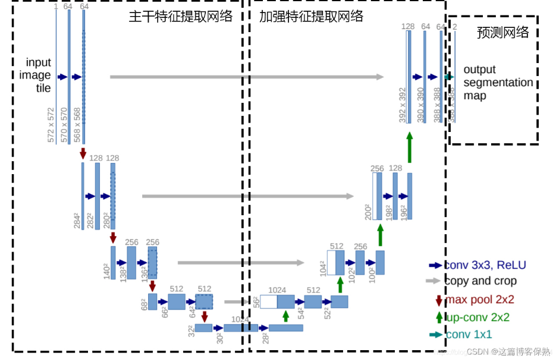

给定初始位置x0和一个时刻t，fai 能给出xt的位置

通过概率路径 pinit--->pdata，反向求解向量场

torch.compile 要求 forward 是“静态的、无副作用的张量计算图

推理:
fai是学习到的向量场fai，步数是n
1. 设置t=0，时间间隔为h= 1/n
2. 从初始分布p采样x0
3. for i=1 to n
    x(t+h)=x(t)+h*fai(x(t))
    t=t+h
4. 返回x1

训练：
1. unet，dataset
2. for each batch of data
    dataset中拿出一个x1
    随机采出一个t (0-1)
    采样一个噪声e
    x= x1+(1-t)e
    计算loss network(x)-(x1-e)

UNET:
Encoder（左）
空间尺寸：256 → 128 → 64 → 32 → 16
通道数：  64  → 128 → 256 → 512 → 1024
Decoder（右）
空间尺寸：16 → 32 → 64 → 128 → 256
通道数：  1024 → 512 → 256 → 128 → 64
U-Net Architecture - Horizontal Layout
