# PPO（近端策略优化）学习笔记

## 一、RL 对齐方法概览

| 路线          | 方法              | 特点                           |
|-------------|-----------------|------------------------------|
| **RL 路线**   | PPO → GRPO（改进版） | 需要 sampling（生成）+ reward（打分）  |
| **非 RL 路线** | DPO             | 直接用偏好数据，不需要 RL sampling loop |

> **一句话理解 PPO**：自己做题、自己预测分数，对答案后修改策略。

---

## 二、PPO 四模型架构

| 模型         | 角色        | 是否更新 | 输入                | 输出                 |
|------------|-----------|------|-------------------|--------------------|
| **Actor**  | 主角 / 策略模型 | ✅ 更新 | prompt            | response（token 序列） |
| **Critic** | 教练 / 价值评估 | ✅ 更新 | prompt + response | V(s) 每步价值预测        |
| **Reward** | 考官 / 奖励打分 | ❌ 冻结 | prompt + response | scalar reward      |
| **Ref**    | 镜子 / 参考基线 | ❌ 冻结 | prompt + response | KL 散度参考分布          |

### 信息流图

```
                        ┌─────────────────────────────────────────────┐
                        │              Prompt (输入问题)               │
                        └─────────────┬───────────────────────────────┘
                                      │
                                      ▼
                ┌──────────────────────────────────────────┐
                │         Actor (主角/策略模型)              │
                │     根据 prompt 生成 response (动作)       │
                └──────┬──────────┬──────────┬─────────────┘
                       │          │          │
          ┌────────────┘          │          └────────────┐
          ▼                       ▼                       ▼
┌──────────────────┐  ┌───────────────────┐  ┌────────────────────────┐
│  Critic (教练)    │  │  Reward (考官)     │  │   Ref (镜子/参考模型)   │
│  预测每个 token   │  │  给完整回答打分     │  │   冻结的初始模型副本     │
│  的状态价值 V(s)  │  │  得到 reward score │  │   计算 KL 散度          │
└────────┬─────────┘  └────────┬──────────┘  └───────────┬────────────┘
         │                     │                         │
         │    ┌────────────────┘                         │
         ▼    ▼                                          │
┌──────────────────────┐                                 │
│   计算 Advantage      │                                 │
│   A = R - V(s)       │                                 │
│   (实际分 - 预测分)   │                                 │
└──────────┬───────────┘                                 │
           │                                             │
           ▼                                             ▼
┌────────────────────────────────────────────────────────────────┐
│                    PPO Loss 计算                                │
│                                                                │
│  L = clip(π/π_old, 1-ε, 1+ε) * A  -  β * KL(π || π_ref)     │
│       ~~~~~~~~~~~~~~~~~~~~~~~~~~~     ~~~~~~~~~~~~~~~~~~~~     │
│         策略梯度 (用 advantage)          KL 惩罚 (防止偏离)      │
└────────────────────────────────────────────────────────────────┘
           │
           ▼
┌──────────────────────────────────┐
│  反向传播更新 Actor & Critic      │
│  (Reward 和 Ref 模型保持冻结)     │
└──────────────────────────────────┘
```



### 核心循环（8 步）

```
1. Actor 生成回答
2. Reward 打分 → 得到实际奖励 R
3. Critic 预测 → 得到预测价值 V(s)
4. Advantage = R - V(s)  (实际 vs 预测的差距)
5. Ref 计算 KL 散度 → 防止 Actor 跑偏
6. 用 PPO clip loss 更新 Actor
7. 用 MSE(V(s), R) 更新 Critic
8. 回到第 1 步
```

---

## 三、代码详解

### 3.1 CriticModel — 价值网络

```python
class CriticModel(MokioMindForCausalLM):
    def __init__(self, params):
        super().__init__(params)
        self.value_head = nn.Linear(params.hidden_size, 1)  # 输出一个标量
```

继承语言模型，但在最后加一个 **价值头**：把 `hidden_size` 压成 1 个标量，代表"当前状态有多好"。

```python
def forward(self, input_ids, attention_mask, **kwargs):
    outputs = self.model(input_ids, attention_mask, **kwargs)
    hidden_states = self.model.norm(outputs[0])  # 取最后一层 hidden state
    values = self.value_head(hidden_states).squeeze(-1)  # [B, L]
    return values
```

> 对每个 token 位置都估计一个价值，后面只取 **最后一个有效 token** 的价值作为整条序列的 V(s)。

---

### 3.2 calculate_rewards — 奖励计算

奖励由 **两部分叠加**：

#### （1）格式奖励（推理模型专用）

```python
pattern = r"^<think>\n.*?\n</think>\n<answer>\n.*?\n</answer>$"
```

用正则匹配 `<think>...</think><answer>...</answer>` 结构：

- 格式完整：**+0.5**
- 每个标签各：**+0.25**（总共最多 **+1.5**）

> 用 RL 训练模型学会"先思考再回答"的格式。

#### （2）Reward 模型打分

```python
score = reward_model.get_score(reward_tokenizer, tmp_chat)
score = max(min(score, scale), -scale)  # 截断到 [-3, 3]，防止极端值
```

对推理模型还会单独对 `<answer>` 内容打分，再加权：

```python
score = score * 0.4 + answer_score * 0.6  # 更看重 answer 内容质量
```

---

### 3.3 ppo_train_epoch — PPO 核心训练循环

#### 步骤 1：生成 Response

```python
gen_out = model_for_gen.generate(...)  # [B, prompt_len + gen_len]
responses_text = [tokenizer.decode(...)]  # 解码每条生成内容
```

#### 步骤 2：计算 Reward

```python
rewards = calculate_rewards(prompts, responses_text, ...)  # [B]，标量奖励
```

#### 步骤 3：Critic 估计价值

```python
value_seq = critic_model(input_ids=gen_out, ...)  # [B, L]
last_indices = full_mask.sum(dim=1) - 1  # 找每条序列最后一个有效 token
values = value_seq[arange, last_indices]  # [B]，标量价值估计
advantages = rewards - values.detach()  # Advantage = R - V(s)
```

> `detach()` 是关键：Advantage 只用于指导 Actor 更新，不对 Critic 产生梯度，两者独立训练。

#### 步骤 4：计算 Actor 的 log 概率

```python
logits = actor_model(gen_out).logits  # [B, L, V]
logp_tokens = F.log_softmax(logits[:, :-1, :], dim=-1)
.gather(2, labels.unsqueeze(-1))  # 只取已生成 token 的概率
actor_logp = (logp_tokens * final_mask).sum(dim=1)  # 只累加 response 部分
```

> `final_mask` 的作用是屏蔽掉 prompt 部分的 token，只关心模型自己生成的内容。

#### 步骤 5：计算 Old Actor 和 Reference 的 log 概率

都用 `torch.no_grad()`：

- **old_logp**：与 `actor_logp` 的比值形成 PPO 的 ratio
- **ref_logp**：与 `actor_logp` 的差值形成 KL 惩罚，防止模型偏离预训练太远

#### 步骤 6：PPO 裁剪损失

```python
ratio = torch.exp(actor_logp - old_logp)  # 新旧策略概率比值
surr1 = ratio * advantages
surr2 = torch.clamp(ratio, 1 - ε, 1 + ε) * advantages  # 裁剪 ratio 到 [0.9, 1.1]
policy_loss = -torch.min(surr1, surr2).mean()  # 取保守的那个
```

> `clip_epsilon=0.1` 限制每步更新不能太激进，避免策略崩塌。

#### 步骤 7：总损失

```python
loss = policy_loss + vf_coef * value_loss + kl_coef * kl_ref
#        策略损失       价值函数损失(×0.5)       KL惩罚(×0.02)
```

| 损失项           | 系数   | 作用            |
|---------------|------|---------------|
| `policy_loss` | 1.0  | 主目标，优化策略      |
| `value_loss`  | 0.5  | 让 Critic 预测更准 |
| `kl_ref`      | 0.02 | 轻惩罚，防止偏离原始模型  |

---

## 四、数据格式与 Reward 模型

### 4.1 训练数据格式

PPO 训练数据 **只有 prompt，没有 answer**，这和 SFT 完全不同：

- **SFT**：需要人工写好正确答案
- **PPO**：只需要问题，让模型自己生成回答，再由 Reward 模型打分

> 这正是 RL 的核心思想：**自己探索，环境反馈**。

数据采用标准 **ChatML** 格式，`system + user` 轮次组成 prompt，模型续写 `assistant` 部分：

```json
{
  "conversations": [
    {
      "role": "user",
      "content": "基于以下角色信息完成一段对话\nA：Alex...B：Bob..."
    },
    {
      "role": "assistant",
      "content": "角色介绍：\nA：Alex...\n对话内容：\nA: 你好..."
    },
    {
      "role": "user",
      "content": "基于以上对话提出一个问题。"
    },
    {
      "role": "assistant",
      "content": "这场对话中，环保组织的代表提出了哪些环保计划的内容？"
    },
    {
      "role": "user",
      "content": "请回答这个问题。"
    },
    {
      "role": "assistant",
      "content": ""
    }
  ]
}
```

> 索引 0、2、4 为 user，1、3、5 为 assistant。最后一条 assistant 的 content 为空，表示需要模型续写。

#### 数据集返回值

```python
return {"prompt": str, "answer": ""}
```

- **prompt**：拼接好的 ChatML 格式文本，发给 Actor 生成回答
- **answer**：PPO 中未使用（为空），在 GRPO 中用于规则函数对比生成结果，答案对了才给奖励

#### prompt 实际样式

```
<|im_start|>user
基于以下角色信息...<|im_end|>
<|im_start|>assistant
角色介绍：...<|im_end|>
...（中间轮次）
<|im_start|>user
请回答这个问题<|im_end|>
<|im_start|>assistant
▌（模型从这里开始续写）
```

### 4.2 Reward 模型

使用 `internlm2-1_8b-reward`，这是 InternLM 团队专门训练的 **奖励模型**
（非普通语言模型）。输入一段对话，输出一个标量分数，代表"这个回答有多好"。

代码中通过正则提取对话结构，再送入 Reward 模型：
calculate_rewards — 奖励计算

格式奖励（推理模型专用） 
```python
pattern = r"<\|im_start\|>(system|user|assistant)\s+(.*?)<\|im_end\|>"
```
（2）Reward模型打分
score = reward_model.get_score(reward_tokenizer, tmp_chat)
score = max(min(score, scale), -scale)   # 截断到[-3, 3]，防止极端值
对推理模型还会单独对 <answer> 内容打分，再加权：
score = score * 0.4 + answer_score * 0.6  # 更看重answer内容质量


### 4.3 KL 散度的作用

> **RLHF 的核心平衡**：用 KL 距离把 Actor 拴在 Reference 附近——你可以优化 Reward，但不能偏离正常语言分布太远，否则 KL 项会把
> Loss 拉高来惩罚你。在 **Reward 最大化** 和 **语言能力保留** 之间取得平衡。
