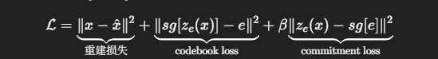

图像编码成token，图像离散化生成离散向量，相对于卷积的稠密向量
1. 下卷积
2. 下卷积后的中间向量替换最近的码本向量(embedding space)(自定义n维)
3. 上卷积重建图像
码本向量的下标作为id(token化)代表图像的特征
例子： mnist 图像分类

普通VAE的连续隐空间：
输入图像 → 编码器 → z = [0.3, -0.7]  （连续的实数）
                    z = [0.31, -0.68]
                    z = [0.29, -0.71]
                    ...

VQ-VAE维护一个码本（codebook），比如说只有4个离散的向量
e_1 = [1.0,  0.5]
e_2 = [-1.0, 0.5]
e_3 = [0.5, -1.0]
e_4 = [-0.5, 1.0]
连续向量 [0.3, -0.7] 
    ↓ (计算距离，找最近邻)
选择码本中距离最近的向量 → e_3 = [0.5, -1.0]

连续向量 [0.98, 0.48]
    ↓ (计算距离，找最近邻)
选择码本中距离最近的向量 → e_1 = [1.0, 0.5]

普通VAE的隐空间
y
 |    图像A的z  •
 |       •  • 图像B的z
 |  •  •     •
 |_______________x
 
连续分布，z可以在任何地方

VQ-VAE的隐空间

y
 |    e_2 •
 |        
 |    e_4 •    • e_1
 |        
 |        • e_3
 |_______________x
 
只有固定的几个点（码本），z必须是其中之一

detach 不参与反向传播的新张量
z_e 编码器输出，z_q codebook
l = x - decoder(z_e + (z_q-z_e).detach)

例如:
z_e = [0.3, -0.7]  (编码器输出)
      ↓
找最近的码本向量 e_3 = [0.5, -1.0]  ← 这个"找最近邻"操作无法求导！
      ↓
z_q = [0.5, -1.0]
"找最近邻"这个操作涉及 argmax，它不可导。如果直接反向传播，梯度无处可去。
通过 stop-gradient + 多个 loss 来“拆梯度”

Straight-Through Estimator (直通估计器) 的技巧( 局部近似里用假梯度，而全局目标仍由真实 loss 约束)
前向传播
z_q = quantize(z_e)  # 找最近邻（离散化）

反向传播（梯度计算）
梯度假装量化是恒等映射（直接通过） 使编码器可以学习
dL/dz_e = dL/dz_q  （好像没有量化一样 f(x) = x）

第一项图像还原loss, 第二项编码器学会产生接近码本的向量 第三项码本向量被拉向编码器的输出

model的codebook也是要被可训练的，

