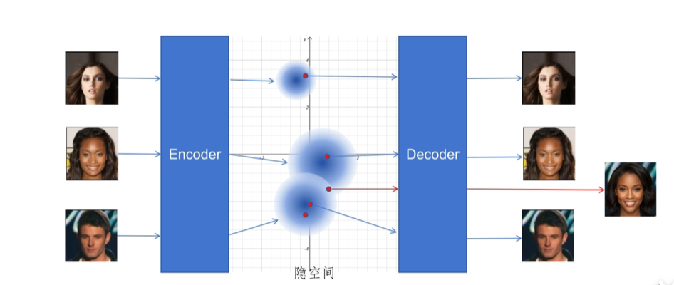
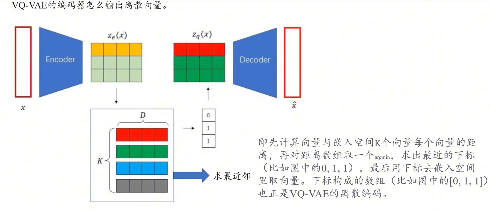

调整均值和方差使其在潜空间内靠近正态分布 KL散度约束

vae_loss = mse(input和output的像素差异) + KL(接近多元正态分布)
KL[N(μ,σ²)||N(0,1)] = -0.5 * Σ[1 + log(σ²) - μ² - σ²]

这2中loss是互相博弈的过程,1.生成图片要和原始图片一致需要潜空间区分 2.kl散度所有图片尽可能接近标准正态分布
重参数化技巧解决不能反向传播, z = μ + σ * ε, 其中 ε ~ N(0,1) 随机性在ε中, μ和σ可导

图片-->encoder-->均值和方差-->采样z隐变量-->decoder-->重建图片